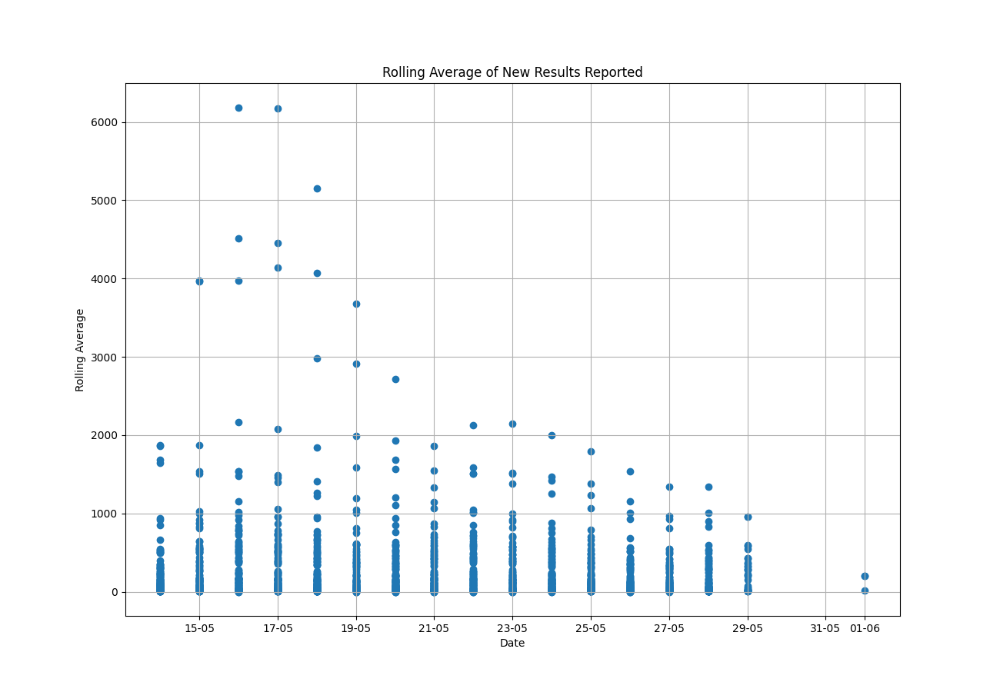

## Metric Documentation

### Total Tests Performed

This metric represents the total number of tests performed up to the provided date.

### Rolling Average of New Results Reported

This metric represents the 7-day rolling average of new results reported for the provided date. It calculates the average number of new cases reported per day for the last 7 days, for each day in the last 30 days.

### Top Ten States with the Highest Number of New Results Reported

This metric represents the top ten states with the highest number of new results reported for the provided date. The positivity rate is displayed as a percentage.

# Total Tests Performed as of yesterday - Date(2024-06-13): 

1,006,554,797,191

# Rolling Average of New Results Reported - Date(2024-06-13):

```
       state total_results_reported       date  7_day_average
12075     AZ                  28343 2024-05-14            NaN
12076     AZ               14293488 2024-05-14            NaN
12077     AZ                2272342 2024-05-14            NaN
12078     AZ                  28344 2024-05-15            NaN
12079     AZ               14294018 2024-05-15            NaN
12080     AZ                2272404 2024-05-15            NaN
12081     AZ                  28344 2024-05-16         169.29
12082     AZ               14294448 2024-05-16         230.71
12083     AZ                2272466 2024-05-16         162.71
12084     AZ                  28344 2024-05-17         155.00
12085     AZ               14294877 2024-05-17         216.14
12086     AZ                2272547 2024-05-17         152.00
12087     AZ                  28344 2024-05-18         143.14
12088     AZ               14295233 2024-05-18         194.00
12089     AZ                2272597 2024-05-18         139.71
12090     AZ                  28344 2024-05-19         130.86
12091     AZ               14295627 2024-05-19         187.14
12092     AZ                2272640 2024-05-19         132.00
12093     AZ                  28344 2024-05-20         120.43
12094     AZ               14296173 2024-05-20         198.43
12095     AZ                2272689 2024-05-20         154.57
12096     AZ                  28344 2024-05-21         147.43
12097     AZ               14296662 2024-05-21         217.29
12098     AZ                2272749 2024-05-21         169.57
12099     AZ                  28344 2024-05-22         163.43
12100     AZ               14297177 2024-05-22         237.00
12101     AZ                2272828 2024-05-22         170.29
12102     AZ                  28344 2024-05-23         163.29
12103     AZ               14297539 2024-05-23         215.00
12104     AZ                2272867 2024-05-23         150.71
12105     AZ                  28344 2024-05-24         142.14
12106     AZ               14297947 2024-05-24         200.43
12107     AZ                2272926 2024-05-24         135.29
12108     AZ                  28344 2024-05-25         124.00
12109     AZ               14298225 2024-05-25         163.71
12110     AZ                2272966 2024-05-25         117.71
12111     AZ                  28344 2024-05-26         112.14
12112     AZ               14298594 2024-05-26         164.86
12113     AZ                2273001 2024-05-26         111.57
12114     AZ                  28344 2024-05-27         103.14
12115     AZ               14298963 2024-05-27         155.86
12116     AZ                2273044 2024-05-27         122.29
12117     AZ                  28344 2024-05-28         116.57
12118     AZ               14298964 2024-05-28         116.71
12119     AZ                2273044 2024-05-28          64.00
16673     AR                  10510 2024-05-14          59.00
16674     AR                5031875 2024-05-14         129.43
16675     AR                 612609 2024-05-14          80.14
16676     AR                  10510 2024-05-15          74.00
16677     AR                5032339 2024-05-15         140.29
16678     AR                 612638 2024-05-15         144.29
16679     AR                  10510 2024-05-16         144.29
16680     AR                5032805 2024-05-16         210.86
16681     AR                 612657 2024-05-16         143.14
16682     AR                  10510 2024-05-17         139.71
16683     AR                5033221 2024-05-17         199.14
16684     AR                 612684 2024-05-17         136.71
16685     AR                  10510 2024-05-18         132.57
16686     AR                5033535 2024-05-18         177.43
16687     AR                 612699 2024-05-18         113.00
16688     AR                  10510 2024-05-19         110.29
16689     AR                5033663 2024-05-19         128.57
16690     AR                 612704 2024-05-19          69.86
16691     AR                  10510 2024-05-20          66.00
16692     AR                5034263 2024-05-20         151.71
16693     AR                 612743 2024-05-20         112.43
16694     AR                  10510 2024-05-21         110.29
16695     AR                5034727 2024-05-21         176.57
16696     AR                 612767 2024-05-21         161.71
16697     AR                  10510 2024-05-22         161.00
16698     AR                5035149 2024-05-22         221.29
16699     AR                 612793 2024-05-22         139.29
16700     AR                  10510 2024-05-23         133.71
16701     AR                5035540 2024-05-23         189.57
16702     AR                 612821 2024-05-23         127.29
16703     AR                  10510 2024-05-24         123.86
16704     AR                5035936 2024-05-24         180.43
16705     AR                 612841 2024-05-24         123.00
16706     AR                  10510 2024-05-25         119.29
16707     AR                5036275 2024-05-25         167.71
16708     AR                 612860 2024-05-25         114.57
16709     AR                  10510 2024-05-26         110.57
16710     AR                5036603 2024-05-26         157.43
16711     AR                 612873 2024-05-26         102.71
16712     AR                  10510 2024-05-27          99.86
16713     AR                5036968 2024-05-27         152.00
16714     AR                 612892 2024-05-27         106.29
16715     AR                  10510 2024-05-28         103.57
16716     AR                5037399 2024-05-28         165.14
16717     AR                 612916 2024-05-28         121.71
21318     CA                 598760 2024-05-14         120.29
21319     CA              168214910 2024-05-14        1865.71
21320     CA               12343350 2024-05-14        1874.43
21321     CA                 598765 2024-05-15        1872.43
21322     CA              168229574 2024-05-15        3967.29
21323     CA               12343817 2024-05-15        3972.43
21324     CA                 598767 2024-05-16        3969.29
21325     CA              168245109 2024-05-16        6188.14
21326     CA               12344297 2024-05-16        4511.29
21327     CA                 598769 2024-05-17        4450.71
21328     CA              168257194 2024-05-17        6176.43
21329     CA               12344718 2024-05-17        4141.71
21330     CA                 598774 2024-05-18        4075.71
21331     CA              168264718 2024-05-18        5150.29
21332     CA               12345037 2024-05-18        2976.57
21333     CA                 598774 2024-05-19        2908.00
21334     CA              168270089 2024-05-19        3675.00
21335     CA               12345336 2024-05-19        1991.29
21336     CA                 598776 2024-05-20        1931.43
21337     CA              168275569 2024-05-20        2713.57
21338     CA               12345685 2024-05-20        1688.57
38049     DC                  14744 2024-05-14        1643.00
38050     DC                5694854 2024-05-14        1688.71
38051     DC                 298857 2024-05-14         922.86
38052     DC                  14744 2024-05-15         880.14
38053     DC                5695132 2024-05-15         919.57
38054     DC                 298869 2024-05-15         138.43
38055     DC                  14744 2024-05-16          88.57
38056     DC                5695433 2024-05-16         131.57
38057     DC                 298882 2024-05-16          87.71
38058     DC                  14744 2024-05-17          86.29
38059     DC                5695683 2024-05-17         122.00
38060     DC                 298890 2024-05-17          83.43
38061     DC                  14744 2024-05-18          81.71
38062     DC                5695888 2024-05-18         111.00
38063     DC                 298899 2024-05-18          69.29
38064     DC                  14744 2024-05-19          67.43
38065     DC                5696114 2024-05-19          99.71
38066     DC                 298908 2024-05-19          65.29
38067     DC                  14744 2024-05-20          64.14
38068     DC                5696390 2024-05-20         103.57
38069     DC                 298922 2024-05-20          76.29
38070     DC                  14744 2024-05-21          75.00
38071     DC                5696680 2024-05-21         116.43
38072     DC                 298933 2024-05-21          85.71
38073     DC                  14744 2024-05-22          84.43
38074     DC                5697002 2024-05-22         130.43
38075     DC                 298941 2024-05-22          92.14
38076     DC                  14744 2024-05-23          90.14
38077     DC                5697252 2024-05-23         125.86
38078     DC                 298955 2024-05-23          86.43
38079     DC                  14744 2024-05-24          84.86
38080     DC                5697469 2024-05-24         115.86
38081     DC                 298964 2024-05-24          71.14
38082     DC                  14744 2024-05-25          70.00
38083     DC                5697666 2024-05-25          98.14
38084     DC                 298972 2024-05-25          63.57
38085     DC                  14744 2024-05-26          61.57
38086     DC                5697812 2024-05-26          82.43
38087     DC                 298986 2024-05-26          53.43
38088     DC                  14744 2024-05-27          52.14
38089     DC                5697986 2024-05-27          77.00
38090     DC                 298999 2024-05-27          50.71
38091     DC                  14744 2024-05-28          49.57
38092     DC                5698194 2024-05-28          79.29
38093     DC                 299011 2024-05-28          60.14
38094     DC                  14744 2024-05-29          58.14
38095     DC                5698274 2024-05-29          69.57
38096     DC                 299020 2024-05-29          46.00
46184     GA                  43385 2024-05-14          44.14
46185     GA               19422358 2024-05-14         297.00
46186     GA                2690270 2024-05-14         274.71
46187     GA                  43385 2024-05-15         273.00
46188     GA               19424037 2024-05-15         512.86
46189     GA                2690324 2024-05-15         509.14
46190     GA                  43385 2024-05-16         507.86
46191     GA               19425926 2024-05-16         777.71
46192     GA                2690389 2024-05-16         534.14
46193     GA                  43385 2024-05-17         526.71
46194     GA               19427334 2024-05-17         727.86
46195     GA                2690463 2024-05-17         498.57
46196     GA                  43385 2024-05-18         490.86
46197     GA               19428487 2024-05-18         655.57
46198     GA                2690502 2024-05-18         391.29
46199     GA                  43385 2024-05-19         382.00
46200     GA               19429430 2024-05-19         516.71
46201     GA                2690540 2024-05-19         321.00
46202     GA                  43385 2024-05-20         310.43
46203     GA               19430909 2024-05-20         521.71
46204     GA                2690597 2024-05-20         365.14
46205     GA                  43385 2024-05-21         359.57
46206     GA               19432213 2024-05-21         545.86
46207     GA                2690662 2024-05-21         420.43
46208     GA                  43385 2024-05-22         415.00
46209     GA               19433521 2024-05-22         601.86
46210     GA                2690728 2024-05-22         400.00
46211     GA                  43385 2024-05-23         391.86
46212     GA               19434800 2024-05-23         574.57
46213     GA                2690808 2024-05-23         399.71
46214     GA                  43385 2024-05-24         390.43
46215     GA               19435897 2024-05-24         547.14
46216     GA                2690868 2024-05-24         368.86
46217     GA                  43385 2024-05-25         359.43
46218     GA               19436795 2024-05-25         487.71
46219     GA                2690918 2024-05-25         312.14
46220     GA                  43385 2024-05-26         300.71
46221     GA               19437639 2024-05-26         421.29
46222     GA                2690961 2024-05-26         270.71
46223     GA                  43385 2024-05-27         262.14
46224     GA               19437981 2024-05-27         311.00
46225     GA                2690971 2024-05-27         184.14
50615     GU                     33 2024-05-14         177.00
50616     GU                 379537 2024-05-14         177.00
50617     GU                  47735 2024-05-14          57.43
50618     GU                     33 2024-05-15          51.29
50619     GU                 379537 2024-05-15          51.29
50620     GU                  47737 2024-05-15           2.71
50621     GU                     33 2024-05-16           1.29
50622     GU                 379537 2024-05-16           1.29
50623     GU                  47744 2024-05-16           2.29
50624     GU                     33 2024-05-17           1.29
50625     GU                 379537 2024-05-17           1.29
50626     GU                  47744 2024-05-17           1.29
50627     GU                     33 2024-05-18           1.00
50628     GU                 379537 2024-05-18           1.00
50629     GU                  47746 2024-05-18           1.29
50630     GU                     33 2024-05-19           0.29
50631     GU                 379537 2024-05-19           0.29
50632     GU                  47746 2024-05-19           0.29
50633     GU                     33 2024-05-20           0.29
50634     GU                 379537 2024-05-20           0.29
50635     GU                  47752 2024-05-20           1.14
50636     GU                     33 2024-05-21           0.86
50637     GU                 379537 2024-05-21           0.86
50638     GU                  47758 2024-05-21           1.71
50639     GU                     33 2024-05-22           1.71
50640     GU                 379538 2024-05-22           1.86
50641     GU                  47764 2024-05-22           2.71
50642     GU                     33 2024-05-23           1.86
50643     GU                 379539 2024-05-23           2.00
50644     GU                  47770 2024-05-23           2.86
50645     GU                     33 2024-05-24           2.00
50646     GU                 379539 2024-05-24           2.00
50647     GU                  47777 2024-05-24           2.86
50648     GU                     33 2024-05-25           2.00
50649     GU                 379539 2024-05-25           2.00
50650     GU                  47781 2024-05-25           2.43
50651     GU                     33 2024-05-26           1.57
50652     GU                 379539 2024-05-26           1.57
50653     GU                  47781 2024-05-26           1.57
50654     GU                     33 2024-05-27           0.57
50655     GU                 379539 2024-05-27           0.57
50656     GU                  47782 2024-05-27           0.71
55231     HI                   1363 2024-05-14           0.14
55232     HI                3991351 2024-05-14          74.00
55233     HI                 327041 2024-05-14          82.57
55234     HI                   1363 2024-05-15          82.57
55235     HI                3991878 2024-05-15         157.86
55236     HI                 327107 2024-05-15         167.29
55237     HI                   1363 2024-05-16         167.14
55238     HI                3992354 2024-05-16         235.14
55239     HI                 327159 2024-05-16         168.71
55240     HI                   1363 2024-05-17         160.14
55241     HI                3992901 2024-05-17         238.29
55242     HI                 327233 2024-05-17         173.57
55243     HI                   1363 2024-05-18         164.14
55244     HI                3993350 2024-05-18         228.29
55245     HI                 327303 2024-05-18         170.29
55246     HI                   1363 2024-05-19         162.86
55247     HI                3993678 2024-05-19         209.71
55248     HI                 327359 2024-05-19         139.57
55249     HI                   1363 2024-05-20         129.00
55250     HI                3994399 2024-05-20         232.00
55251     HI                 327473 2024-05-20         184.14
55252     HI                   1363 2024-05-21         174.14
55253     HI                3994938 2024-05-21         251.14
55254     HI                 327564 2024-05-21         217.29
55255     HI                   1363 2024-05-22         209.29
55256     HI                3995510 2024-05-22         291.00
55257     HI                 327670 2024-05-22         203.14
55258     HI                   1363 2024-05-23         186.86
55259     HI                3996149 2024-05-23         278.14
55260     HI                 327734 2024-05-23         210.29
55261     HI                   1363 2024-05-24         197.29
55262     HI                3996149 2024-05-24         197.29
55263     HI                 327734 2024-05-24         115.57
55264     HI                   1363 2024-05-25         100.43
55265     HI                3996149 2024-05-25         100.43
55266     HI                 327734 2024-05-25           9.14
55267     HI                   1363 2024-05-26           0.00
55268     HI                3996149 2024-05-26           0.00
55269     HI                 327734 2024-05-26           0.00
55270     HI                   1363 2024-05-27           0.00
55271     HI                3996154 2024-05-27           0.71
55272     HI                 327735 2024-05-27           0.86
55273     HI                   1363 2024-05-28           0.86
55274     HI                3996158 2024-05-28           1.43
55275     HI                 327735 2024-05-28           1.43
59869     ID                   5708 2024-05-14           1.43
59870     ID                3089539 2024-05-14           2.00
59871     ID                 673744 2024-05-14           3.43
59872     ID                   5708 2024-05-15           3.29
59873     ID                3089542 2024-05-15           3.71
59874     ID                 673752 2024-05-15           4.29
59875     ID                   5708 2024-05-16           4.29
59876     ID                3089548 2024-05-16           5.14
59877     ID                 673761 2024-05-16           5.86
59878     ID                   5708 2024-05-17           3.71
59879     ID                3089552 2024-05-17           4.29
59880     ID                 673771 2024-05-17           5.29
59881     ID                   5708 2024-05-18           4.14
59882     ID                3089558 2024-05-18           5.00
59883     ID                 673787 2024-05-18           6.43
59884     ID                   5708 2024-05-19           5.14
59885     ID                3089561 2024-05-19           5.57
59886     ID                 673799 2024-05-19           6.71
59887     ID                   5708 2024-05-20           5.29
59888     ID                3089565 2024-05-20           5.86
59889     ID                 673807 2024-05-20           6.14
59890     ID                   5708 2024-05-21           3.86
59891     ID                3089572 2024-05-21           4.86
59892     ID                 673822 2024-05-21           6.57
59893     ID                   5708 2024-05-22           4.86
59894     ID                3089573 2024-05-22           5.00
59895     ID                 673836 2024-05-22           6.43
59896     ID                   5708 2024-05-23           5.29
59897     ID                3089579 2024-05-23           6.14
59898     ID                 673845 2024-05-23           6.43
59899     ID                   5709 2024-05-24           4.43
59900     ID                3089582 2024-05-24           4.86
59901     ID                 673850 2024-05-24           5.43
59902     ID                   5709 2024-05-25           3.43
59903     ID                3089582 2024-05-25           3.43
59904     ID                 673852 2024-05-25           2.86
59905     ID                   5709 2024-05-26           1.57
59906     ID                3089583 2024-05-26           1.57
59907     ID                 673866 2024-05-26           3.14
59908     ID                   5709 2024-05-27           2.43
59909     ID                3089585 2024-05-27           2.71
59910     ID                 673885 2024-05-27           5.43
59911     ID                   5709 2024-05-28           5.14
59912     ID                3089586 2024-05-28           5.29
59913     ID                 673895 2024-05-28           6.57
64511     IL                 110090 2024-05-14           4.57
64512     IL               54624954 2024-05-14         528.86
64513     IL                3920861 2024-05-14         544.57
64514     IL                 110091 2024-05-15         542.00
64515     IL               54628171 2024-05-15        1001.57
64516     IL                3921004 2024-05-15        1021.86
64517     IL                 110091 2024-05-16        1020.43
64518     IL               54631382 2024-05-16        1479.14
64519     IL                3921137 2024-05-16         973.86
64520     IL                 110091 2024-05-17         957.86
64521     IL               54634502 2024-05-17        1403.43
64522     IL                3921255 2024-05-17         960.71
64523     IL                 110091 2024-05-18         940.29
64524     IL               54636449 2024-05-18        1218.43
64525     IL                3921356 2024-05-18         774.14
64526     IL                 110091 2024-05-19         755.14
64527     IL               54638478 2024-05-19        1045.00
64528     IL                3921442 2024-05-19         611.57
64529     IL                 110094 2024-05-20         595.14
64530     IL               54642069 2024-05-20        1108.14
64531     IL                3921560 2024-05-20         846.86
64532     IL                 110094 2024-05-21         832.43
64533     IL               54645568 2024-05-21        1332.29
64534     IL                3921695 2024-05-21        1061.71
64535     IL                 110096 2024-05-22        1049.71
64536     IL               54648782 2024-05-22        1508.43
64537     IL                3921831 2024-05-22        1014.86
64538     IL                 110096 2024-05-23         998.00
64539     IL               54651443 2024-05-23        1378.14
64540     IL                3921942 2024-05-23         894.14
64541     IL                 110096 2024-05-24         874.86
64542     IL               54654105 2024-05-24        1254.86
64543     IL                3922071 2024-05-24         814.14
64544     IL                 110096 2024-05-25         794.71
64545     IL               54656022 2024-05-25        1068.57
64546     IL                3922162 2024-05-25         701.43
64547     IL                 110096 2024-05-26         685.57
64548     IL               54657751 2024-05-26         932.57
64549     IL                3922247 2024-05-26         564.43
64550     IL                 110096 2024-05-27         546.00
64551     IL               54659586 2024-05-27         808.14
64552     IL                3922321 2024-05-27         544.86
64553     IL                 110096 2024-05-28         531.86
64554     IL               54661644 2024-05-28         825.86
64555     IL                3922434 2024-05-28         595.00
64556     IL                 110096 2024-05-29         582.86
64557     IL               54661726 2024-05-29         594.57
64558     IL                3922437 2024-05-29         332.86
69140     IN                  34441 2024-05-14         322.29
69141     IN               14222011 2024-05-14         517.14
69142     IN                2031894 2024-05-14         227.86
69143     IN                  34441 2024-05-15         211.71
69144     IN               14223205 2024-05-15         382.29
69145     IN                2031923 2024-05-15         374.71
69146     IN                  34441 2024-05-16         374.29
69147     IN               14224478 2024-05-16         556.14
69148     IN                2031949 2024-05-16         365.00
69149     IN                  34441 2024-05-17         360.29
69150     IN               14225622 2024-05-17         523.71
69151     IN                2031978 2024-05-17         357.29
69152     IN                  34441 2024-05-18         353.14
69153     IN               14226188 2024-05-18         434.00
69154     IN                2031989 2024-05-18         253.71
69155     IN                  34441 2024-05-19         250.00
69156     IN               14227070 2024-05-19         376.00
69157     IN                2032000 2024-05-19         214.14
69158     IN                  34441 2024-05-20         210.00
69159     IN               14227650 2024-05-20         292.86
69160     IN                2032013 2024-05-20         213.86
77608     KS                  16186 2024-05-14         212.29
77609     KS                5580918 2024-05-14         249.29
77610     KS                 792646 2024-05-14         125.29
77611     KS                  16186 2024-05-15         123.71
77612     KS                5581119 2024-05-15         152.43
77613     KS                 792664 2024-05-15          72.14
77614     KS                  16186 2024-05-16          70.29
77615     KS                5581331 2024-05-16         100.57
77616     KS                 792678 2024-05-16          65.57
77617     KS                  16186 2024-05-17          63.57
77618     KS                5581552 2024-05-17          95.14
77619     KS                 792696 2024-05-17          69.00
77620     KS                  16186 2024-05-18          66.43
77621     KS                5581709 2024-05-18          88.86
77622     KS                 792704 2024-05-18          59.71
77623     KS                  16186 2024-05-19          57.71
77624     KS                5581886 2024-05-19          83.00
77625     KS                 792708 2024-05-19          52.00
77626     KS                  16186 2024-05-20          49.43
77627     KS                5582158 2024-05-20          88.29
77628     KS                 792720 2024-05-20          67.57
77629     KS                  16186 2024-05-21          66.43
77630     KS                5582452 2024-05-21         108.43
77631     KS                 792737 2024-05-21          85.57
77632     KS                  16186 2024-05-22          85.00
77633     KS                5582694 2024-05-22         119.57
77634     KS                 792745 2024-05-22          81.86
77635     KS                  16186 2024-05-23          80.14
77636     KS                5582954 2024-05-23         117.29
77637     KS                 792753 2024-05-23          76.43
77638     KS                  16186 2024-05-24          74.00
77639     KS                5583166 2024-05-24         104.29
77640     KS                 792763 2024-05-24          71.14
77641     KS                  16187 2024-05-25          70.14
77642     KS                5583295 2024-05-25          88.57
77643     KS                 792773 2024-05-25          52.86
77644     KS                  16187 2024-05-26          51.71
77645     KS                5583472 2024-05-26          77.00
77646     KS                 792778 2024-05-26          47.43
77647     KS                  16187 2024-05-27          46.00
77648     KS                5583634 2024-05-27          69.00
77649     KS                 792780 2024-05-27          50.86
77650     KS                  16187 2024-05-28          49.43
77651     KS                5583838 2024-05-28          78.57
77652     KS                 792786 2024-05-28          54.14
82233     KY                  12936 2024-05-14          53.43
82234     KY               10612947 2024-05-14         328.57
82235     KY                1555222 2024-05-14         315.29
82236     KY                  12936 2024-05-15         315.00
82237     KY               10614651 2024-05-15         558.43
82238     KY                1555272 2024-05-15         536.43
82239     KY                  12936 2024-05-16         535.57
82240     KY               10616374 2024-05-16         781.71
82241     KY                1555335 2024-05-16         515.57
82242     KY                  12938 2024-05-17         506.00
82243     KY               10617990 2024-05-17         736.86
82244     KY                1555399 2024-05-17         502.57
82245     KY                  12938 2024-05-18         495.43
82246     KY               10619217 2024-05-18         670.71
82247     KY                1555428 2024-05-18         428.71
82248     KY                  12938 2024-05-19         419.71
82249     KY               10620439 2024-05-19         594.00
82250     KY                1555456 2024-05-19         367.14
82251     KY                  12938 2024-05-20         358.00
82252     KY               10622090 2024-05-20         593.86
82253     KY                1555512 2024-05-20         426.57
82254     KY                  12938 2024-05-21         422.43
82255     KY               10623686 2024-05-21         650.43
82256     KY                1555565 2024-05-21         483.43
82257     KY                  12938 2024-05-22         479.43
82258     KY               10625327 2024-05-22         713.86
82259     KY                1555618 2024-05-22         485.57
82260     KY                  12938 2024-05-23         477.57
82261     KY               10626882 2024-05-23         699.71
82262     KY                1555665 2024-05-23         478.43
82263     KY                  12938 2024-05-24         470.86
82264     KY               10628284 2024-05-24         671.14
82265     KY                1555712 2024-05-24         443.43
82266     KY                  12938 2024-05-25         435.86
82267     KY               10629428 2024-05-25         599.29
82268     KY                1555750 2024-05-25         382.57
82269     KY                  12938 2024-05-26         375.86
82270     KY               10630434 2024-05-26         519.57
82271     KY                1555779 2024-05-26         323.43
82272     KY                  12938 2024-05-27         316.71
82273     KY               10631591 2024-05-27         482.00
82274     KY                1555824 2024-05-27         325.00
82275     KY                  12938 2024-05-28         319.57
82276     KY               10632426 2024-05-28         438.86
82277     KY                1555857 2024-05-28         299.86
86869     LA                  20566 2024-05-14         295.71
86870     LA               11822313 2024-05-14         507.57
86871     LA                1211070 2024-05-14         349.57
86872     LA                  20566 2024-05-15         343.14
86873     LA               11823799 2024-05-15         555.43
86874     LA                1211109 2024-05-15         441.71
86875     LA                  20566 2024-05-16         437.00
86876     LA               11825149 2024-05-16         629.86
86877     LA                1211162 2024-05-16         425.57
86878     LA                  20566 2024-05-17         418.29
86879     LA               11826456 2024-05-17         605.00
86880     LA                1211217 2024-05-17         400.57
86881     LA                  20566 2024-05-18         395.00
86882     LA               11827466 2024-05-18         539.29
86883     LA                1211252 2024-05-18         351.43
86884     LA                  20566 2024-05-19         343.86
86885     LA               11828592 2024-05-19         504.71
86886     LA                1211290 2024-05-19         323.43
86887     LA                  20566 2024-05-20         315.57
86888     LA               11829976 2024-05-20         513.29
86889     LA                1211355 2024-05-20         378.29
86890     LA                  20566 2024-05-21         373.29
86891     LA               11831434 2024-05-21         581.57
86892     LA                1211411 2024-05-21         428.71
86893     LA                  20566 2024-05-22         423.29
86894     LA               11832758 2024-05-22         612.43
86895     LA                1211469 2024-05-22         423.00
86896     LA                  20566 2024-05-23         413.71
86897     LA               11833879 2024-05-23         573.86
86898     LA                1211527 2024-05-23         373.86
86899     LA                  20566 2024-05-24         365.86
86900     LA               11834961 2024-05-24         520.43
86901     LA                1211589 2024-05-24         340.14
86902     LA                  20566 2024-05-25         331.86
86903     LA               11835951 2024-05-25         473.29
86904     LA                1211633 2024-05-25         319.43
86905     LA                  20566 2024-05-26         311.14
86906     LA               11836830 2024-05-26         436.71
86907     LA                1211675 2024-05-26         288.14
86908     LA                  20566 2024-05-27         279.29
86909     LA               11837828 2024-05-27         421.86
86910     LA                1211728 2024-05-27         288.00
86911     LA                  20566 2024-05-28         281.71
86912     LA               11838700 2024-05-28         406.29
86913     LA                1211777 2024-05-28         287.71
86914     LA                  20566 2024-05-29         281.71
86915     LA               11838761 2024-05-29         290.43
86916     LA                1211777 2024-05-29         147.86
91497     ME                   7532 2024-05-14         140.29
91498     ME                4364896 2024-05-14         163.86
91499     ME                 290118 2024-05-14          40.86
91500     ME                   7532 2024-05-15          33.86
91501     ME                4365074 2024-05-15          59.29
91502     ME                 290134 2024-05-15          52.86
91503     ME                   7532 2024-05-16          52.86
91504     ME                4365258 2024-05-16          79.14
91505     ME                 290152 2024-05-16          58.14
91506     ME                   7532 2024-05-17          56.57
91507     ME                4365407 2024-05-17          77.86
91508     ME                 290164 2024-05-17          54.14
91509     ME                   7532 2024-05-18          51.86
91510     ME                4365519 2024-05-18          67.86
91511     ME                 290177 2024-05-18          43.43
91512     ME                   7532 2024-05-19          40.86
91513     ME                4365649 2024-05-19          59.43
91514     ME                 290186 2024-05-19          39.43
91515     ME                   7532 2024-05-20          37.71
91516     ME                4365815 2024-05-20          61.43
91517     ME                 290205 2024-05-20          48.14
91518     ME                   7532 2024-05-21          46.29
91519     ME                4365975 2024-05-21          69.14
91520     ME                 290219 2024-05-21          52.57
91521     ME                   7532 2024-05-22          51.29
91522     ME                4366113 2024-05-22          71.00
91523     ME                 290227 2024-05-22          48.43
91524     ME                   7532 2024-05-23          45.71
91525     ME                4366249 2024-05-23          65.14
91526     ME                 290238 2024-05-23          43.86
91527     ME                   7532 2024-05-24          41.86
91528     ME                4366387 2024-05-24          61.57
91529     ME                 290247 2024-05-24          43.14
91530     ME                   7532 2024-05-25          42.00
91531     ME                4366493 2024-05-25          57.14
91532     ME                 290253 2024-05-25          38.57
91533     ME                   7532 2024-05-26          37.00
91534     ME                4366578 2024-05-26          49.14
91535     ME                 290266 2024-05-26          31.29
91536     ME                   7532 2024-05-27          30.00
91537     ME                4366694 2024-05-27          46.57
91538     ME                 290276 2024-05-27          32.86
91539     ME                   7532 2024-05-28          32.00
91540     ME                4366781 2024-05-28          44.43
91541     ME                 290280 2024-05-28          32.86
98659     MD                  38885 2024-05-14          31.00
98660     MD               23798968 2024-05-14         350.57
98661     MD                2314650 2024-05-14         344.86
98662     MD                  38885 2024-05-15         343.43
98663     MD               23801095 2024-05-15         647.29
98664     MD                2314714 2024-05-15         644.00
98665     MD                  38886 2024-05-16         643.57
98666     MD               23803003 2024-05-16         916.14
98667     MD                2314807 2024-05-16         609.86
98668     MD                  38887 2024-05-17         599.14
98669     MD               23804902 2024-05-17         870.43
98670     MD                2314892 2024-05-17         578.71
98671     MD                  38887 2024-05-18         569.57
98672     MD               23806012 2024-05-18         728.00
98673     MD                2314940 2024-05-18         462.29
98674     MD                  38887 2024-05-19         449.00
98675     MD               23807106 2024-05-19         605.14
98676     MD                2314988 2024-05-19         340.71
98677     MD                  38887 2024-05-20         328.57
98678     MD               23809061 2024-05-20         607.86
98679     MD                2315065 2024-05-20         460.29
98680     MD                  38887 2024-05-21         453.43
98681     MD               23811040 2024-05-21         736.14
98682     MD                2315153 2024-05-21         592.43
98683     MD                  38887 2024-05-22         585.57
98684     MD               23812902 2024-05-22         851.57
98685     MD                2315244 2024-05-22         585.29
98686     MD                  38888 2024-05-23         574.43
98687     MD               23814610 2024-05-23         818.43
98688     MD                2315317 2024-05-23         546.14
98689     MD                  38890 2024-05-24         533.86
98690     MD               23816142 2024-05-24         752.71
98691     MD                2315386 2024-05-24         496.57
98692     MD                  38891 2024-05-25         483.71
98693     MD               23817374 2024-05-25         659.57
98694     MD                2315429 2024-05-25         421.71
98695     MD                  38891 2024-05-26         411.29
98696     MD               23818406 2024-05-26         558.43
98697     MD                2315474 2024-05-26         346.00
98698     MD                  38891 2024-05-27         336.14
98699     MD               23818957 2024-05-27         414.71
98700     MD                2315496 2024-05-27         241.86
103296    MA                  95609 2024-05-14         235.71
103297    MA               46634091 2024-05-14         663.86
103298    MA                2259056 2024-05-14         537.57
103299    MA                  95609 2024-05-15         531.14
103300    MA               46636464 2024-05-15         870.14
103301    MA                2259165 2024-05-15         807.00
103302    MA                  95609 2024-05-16         803.86
103303    MA               46638898 2024-05-16        1151.57
103304    MA                2259297 2024-05-16         742.29
103305    MA                  95609 2024-05-17         721.14
103306    MA               46641262 2024-05-17        1058.86
103307    MA                2259411 2024-05-17         736.14
103308    MA                  95609 2024-05-18         720.57
103309    MA               46642940 2024-05-18         960.29
103310    MA                2259495 2024-05-18         624.57
103311    MA                  95609 2024-05-19         605.71
103312    MA               46644339 2024-05-19         805.57
103313    MA                2259564 2024-05-19         477.71
103314    MA                  95609 2024-05-20         461.43
103315    MA               46646426 2024-05-20         759.57
103316    MA                2259659 2024-05-20         533.43
103317    MA                  95609 2024-05-21         521.43
103318    MA               46648856 2024-05-21         868.57
103319    MA                2259796 2024-05-21         688.29
103320    MA                  95610 2024-05-22         678.57
103321    MA               46651147 2024-05-22        1005.86
103322    MA                2259912 2024-05-22         724.29
103323    MA                  95610 2024-05-23         710.71
103324    MA               46652567 2024-05-23         913.57
103325    MA                2259981 2024-05-23         576.29
103326    MA                  95610 2024-05-24         556.71
103327    MA               46652627 2024-05-24         565.14
103328    MA                2259985 2024-05-24         238.43
103329    MA                  95610 2024-05-25         221.86
103330    MA               46652669 2024-05-25         227.86
103331    MA                2259990 2024-05-25          25.71
103332    MA                  95610 2024-05-26          15.86
103333    MA               46653208 2024-05-26          92.86
103334    MA                2260014 2024-05-26          87.71
103335    MA                  95610 2024-05-27          87.14
103336    MA               46654678 2024-05-27         297.14
103337    MA                2260077 2024-05-27         300.14
103338    MA                  95610 2024-05-28         299.43
103339    MA               46656044 2024-05-28         494.57
103340    MA                2260136 2024-05-28         426.00
103341    MA                  95610 2024-05-29         422.57
103342    MA               46656070 2024-05-29         426.29
103343    MA                2260137 2024-05-29         216.43
107920    MI                  88817 2024-05-14         207.43
107921    MI               26352659 2024-05-14         399.86
107922    MI                3313799 2024-05-14         216.14
107923    MI                  88817 2024-05-15         207.71
107924    MI               26353937 2024-05-15         390.29
107925    MI                3313854 2024-05-15         394.43
107926    MI                  88817 2024-05-16         394.29
107927    MI               26355191 2024-05-16         573.43
107928    MI                3313922 2024-05-16         390.71
107929    MI                  88817 2024-05-17         379.29
107930    MI               26356415 2024-05-17         554.14
107931    MI                3314006 2024-05-17         383.57
107932    MI                  88817 2024-05-18         375.71
107933    MI               26357385 2024-05-18         514.29
107934    MI                3314057 2024-05-18         342.43
107935    MI                  88817 2024-05-19         332.71
107936    MI               26358323 2024-05-19         466.71
107937    MI                3314107 2024-05-19         299.00
107938    MI                  88817 2024-05-20         287.00
107939    MI               26359564 2024-05-20         464.29
107940    MI                3314169 2024-05-20         334.57
107941    MI                  88817 2024-05-21         327.29
107942    MI               26360840 2024-05-21         509.57
107943    MI                3314236 2024-05-21         385.14
107944    MI                  88817 2024-05-22         378.00
107945    MI               26362126 2024-05-22         561.71
107946    MI                3314308 2024-05-22         394.71
107947    MI                  88817 2024-05-23         385.86
107948    MI               26363170 2024-05-23         535.00
107949    MI                3314380 2024-05-23         363.00
107950    MI                  88817 2024-05-24         353.43
107951    MI               26364206 2024-05-24         501.43
107952    MI                3314423 2024-05-24         323.86
107953    MI                  88817 2024-05-25         313.57
107954    MI               26365059 2024-05-25         435.43
107955    MI                3314473 2024-05-25         293.43
107956    MI                  88817 2024-05-26         283.14
107957    MI               26365831 2024-05-26         393.43
107958    MI                3314512 2024-05-26         251.00
107959    MI                  88818 2024-05-27         245.00
107960    MI               26366704 2024-05-27         369.71
107961    MI                3314558 2024-05-27         254.43
107962    MI                  88818 2024-05-28         247.29
107963    MI               26367665 2024-05-28         384.57
107964    MI                3314620 2024-05-28         283.14
107965    MI                  88818 2024-05-29         277.57
107966    MI               26367962 2024-05-29         319.86
107967    MI                3314638 2024-05-29         197.71
125007    MT                   3761 2024-05-14         191.14
125008    MT                2035526 2024-05-14         197.57
125009    MT                 308205 2024-05-14          62.86
125010    MT                   3761 2024-05-15          54.00
125011    MT                2035553 2024-05-15          57.86
125012    MT                 308219 2024-05-15          17.43
125013    MT                   3761 2024-05-16          14.86
125014    MT                2035588 2024-05-16          19.86
125015    MT                 308226 2024-05-16          14.43
125016    MT                   3761 2024-05-17          11.86
125017    MT                2035604 2024-05-17          14.14
125018    MT                 308233 2024-05-17          11.29
125019    MT                   3761 2024-05-18           9.29
125020    MT                2035613 2024-05-18          10.57
125021    MT                 308238 2024-05-18           6.29
125022    MT                   3761 2024-05-19           5.29
125023    MT                2035644 2024-05-19           9.71
125024    MT                 308251 2024-05-19           9.29
125025    MT                   3761 2024-05-20           8.29
125026    MT                2035690 2024-05-20          14.86
125027    MT                 308269 2024-05-20          16.14
125028    MT                   3761 2024-05-21          15.43
125029    MT                2035734 2024-05-21          21.71
125030    MT                 308278 2024-05-21          18.57
125031    MT                   3761 2024-05-22          16.71
125032    MT                2035760 2024-05-22          20.43
125033    MT                 308284 2024-05-22          14.71
125034    MT                   3761 2024-05-23          12.14
125035    MT                2035782 2024-05-23          15.29
125036    MT                 308293 2024-05-23          10.29
125037    MT                   3761 2024-05-24           9.00
125038    MT                2035790 2024-05-24          10.14
125039    MT                 308295 2024-05-24           6.71
125040    MT                   3761 2024-05-25           5.86
125041    MT                2035804 2024-05-25           7.86
125042    MT                 308302 2024-05-25           5.71
125043    MT                   3761 2024-05-26           4.43
125044    MT                2035835 2024-05-26           8.86
125045    MT                 308312 2024-05-26           9.14
125046    MT                   3761 2024-05-27           8.86
125047    MT                2035863 2024-05-27          12.86
125048    MT                 308324 2024-05-27          12.57
125049    MT                   3761 2024-05-28          11.57
125050    MT                2035887 2024-05-28          15.00
125051    MT                 308340 2024-05-28          12.86
129654    NE                   1939 2024-05-14          11.43
129655    NE                2726227 2024-05-14          21.57
129656    NE                 438189 2024-05-14          18.00
129657    NE                   1939 2024-05-15          16.29
129658    NE                2726318 2024-05-15          29.29
129659    NE                 438190 2024-05-15          26.00
129660    NE                   1939 2024-05-16          23.71
129661    NE                2726438 2024-05-16          40.86
129662    NE                 438198 2024-05-16          31.86
129663    NE                   1939 2024-05-17          31.43
129664    NE                2726604 2024-05-17          55.14
129665    NE                 438201 2024-05-17          42.57
129666    NE                   1939 2024-05-18          42.43
129667    NE                2726704 2024-05-18          56.71
129668    NE                 438204 2024-05-18          40.00
129669    NE                   1939 2024-05-19          38.86
129670    NE                2726808 2024-05-19          53.71
129671    NE                 438208 2024-05-19          30.57
129672    NE                   1939 2024-05-20          30.14
129673    NE                2726895 2024-05-20          42.57
129674    NE                 438212 2024-05-20          28.86
129675    NE                   1939 2024-05-21          28.43
129676    NE                2726996 2024-05-21          42.86
129677    NE                 438214 2024-05-21          28.29
129678    NE                   1939 2024-05-22          27.71
129679    NE                2727091 2024-05-22          41.29
129680    NE                 438220 2024-05-22          29.71
129681    NE                   1939 2024-05-23          29.14
129682    NE                2727204 2024-05-23          45.29
129683    NE                 438226 2024-05-23          31.71
129684    NE                   1939 2024-05-24          31.43
129685    NE                2727406 2024-05-24          60.29
129686    NE                 438230 2024-05-24          47.29
129687    NE                   1939 2024-05-25          46.43
129688    NE                2727506 2024-05-25          60.71
129689    NE                 438236 2024-05-25          45.43
129690    NE                   1939 2024-05-26          44.57
129691    NE                2727584 2024-05-26          55.71
129692    NE                 438237 2024-05-26          27.00
129693    NE                   1939 2024-05-27          26.43
129694    NE                2727661 2024-05-27          37.43
129695    NE                 438240 2024-05-27          23.57
129696    NE                   1939 2024-05-28          22.71
129697    NE                2727765 2024-05-28          37.57
129698    NE                 438241 2024-05-28          26.57
134262    NV                  14151 2024-05-14          26.43
134263    NV                6085368 2024-05-14          85.86
134264    NV                1024741 2024-05-14          85.14
134265    NV                  14151 2024-05-15          84.71
134266    NV                6085700 2024-05-15         132.14
134267    NV                1024780 2024-05-15         122.86
134268    NV                  14151 2024-05-16         122.71
134269    NV                6085978 2024-05-16         162.43
134270    NV                1024822 2024-05-16         109.00
134271    NV                  14151 2024-05-17          98.71
134272    NV                6086271 2024-05-17         140.57
134273    NV                1024852 2024-05-17          97.43
134274    NV                  14151 2024-05-18          91.86
134275    NV                6086542 2024-05-18         130.57
134276    NV                1024892 2024-05-18          96.57
134277    NV                  14151 2024-05-19          90.57
134278    NV                6086763 2024-05-19         122.14
134279    NV                1024928 2024-05-19          85.43
134280    NV                  14151 2024-05-20          81.14
134281    NV                6087062 2024-05-20         123.86
134282    NV                1024975 2024-05-20          91.86
134283    NV                  14151 2024-05-21          86.14
134284    NV                6087423 2024-05-21         137.71
134285    NV                1025013 2024-05-21         111.57
134286    NV                  14151 2024-05-22         106.43
134287    NV                6087811 2024-05-22         161.86
134288    NV                1025106 2024-05-22         132.43
134289    NV                  14151 2024-05-23         125.71
134290    NV                6088089 2024-05-23         165.43
134291    NV                1025162 2024-05-23         121.86
134292    NV                  14151 2024-05-24         116.43
134293    NV                6088361 2024-05-24         155.29
134294    NV                1025205 2024-05-24         106.00
134295    NV                  14151 2024-05-25          92.71
134296    NV                6088642 2024-05-25         132.86
134297    NV                1025260 2024-05-25         101.00
134298    NV                  14151 2024-05-26          93.00
134299    NV                6088875 2024-05-26         126.29
134300    NV                1025303 2024-05-26          93.57
134301    NV                  14151 2024-05-27          87.43
134302    NV                6089107 2024-05-27         120.57
134303    NV                1025346 2024-05-27          86.57
138894    NH                   5565 2024-05-14          78.71
138895    NH                4232980 2024-05-14         118.43
138896    NH                 321395 2024-05-14          86.14
138897    NH                   5565 2024-05-15          80.00
138898    NH                4233242 2024-05-15         117.43
138899    NH                 321404 2024-05-15          85.57
138900    NH                   5565 2024-05-16          79.43
138901    NH                4233475 2024-05-16         112.71
138902    NH                 321420 2024-05-16          75.29
138903    NH                   5565 2024-05-17          74.29
138904    NH                4233705 2024-05-17         107.14
138905    NH                 321431 2024-05-17          71.29
138906    NH                   5565 2024-05-18          70.00
138907    NH                4233882 2024-05-18          95.29
138908    NH                 321436 2024-05-18          62.71
138909    NH                   5565 2024-05-19          60.43
138910    NH                4234083 2024-05-19          89.14
138911    NH                 321447 2024-05-19          57.86
138912    NH                   5565 2024-05-20          56.29
138913    NH                4234344 2024-05-20          93.57
138914    NH                 321455 2024-05-20          69.43
138915    NH                   5565 2024-05-21          68.71
138916    NH                4234588 2024-05-21         103.57
138917    NH                 321462 2024-05-21          75.86
138918    NH                   5565 2024-05-22          74.29
138919    NH                4234831 2024-05-22         109.00
138920    NH                 321472 2024-05-22          73.14
138921    NH                   5565 2024-05-23          72.00
138922    NH                4235035 2024-05-23         101.14
138923    NH                 321485 2024-05-23          68.14
138924    NH                   5565 2024-05-24          67.14
138925    NH                4235216 2024-05-24          93.00
138926    NH                 321494 2024-05-24          59.57
138927    NH                   5565 2024-05-25          58.14
138928    NH                4235378 2024-05-25          81.29
138929    NH                 321503 2024-05-25          53.43
138930    NH                   5565 2024-05-26          51.57
138931    NH                4235553 2024-05-26          76.57
138932    NH                 321510 2024-05-26          51.71
138933    NH                   5565 2024-05-27          50.43
138934    NH                4235707 2024-05-27          72.43
138935    NH                 321516 2024-05-27          50.14
138936    NH                   5565 2024-05-28          48.86
138937    NH                4235718 2024-05-28          50.43
138938    NH                 321516 2024-05-28          25.43
143521    NJ                  66780 2024-05-14          24.43
143522    NJ               30430622 2024-05-14         301.57
143523    NJ                2843482 2024-05-14         297.00
143524    NJ                  66780 2024-05-15         296.14
143525    NJ               30432517 2024-05-15         566.86
143526    NJ                2843608 2024-05-15         583.29
143527    NJ                  66780 2024-05-16         583.29
143528    NJ               30434344 2024-05-16         844.29
143529    NJ                2843767 2024-05-16         589.86
143530    NJ                  66780 2024-05-17         572.43
143531    NJ               30435771 2024-05-17         776.29
143532    NJ                2843869 2024-05-17         520.14
143533    NJ                  66780 2024-05-18         502.14
143534    NJ               30436910 2024-05-18         664.86
143535    NJ                2843967 2024-05-18         417.86
143536    NJ                  66780 2024-05-19         395.14
143537    NJ               30438369 2024-05-19         603.57
143538    NJ                2844079 2024-05-19         415.71
143539    NJ                  66780 2024-05-20         401.14
143540    NJ               30440017 2024-05-20         636.57
143541    NJ                2844208 2024-05-20         492.29
143542    NJ                  66780 2024-05-21         478.29
143543    NJ               30441592 2024-05-21         703.29
143544    NJ                2844359 2024-05-21         516.43
143545    NJ                  66780 2024-05-22         500.43
143546    NJ               30443414 2024-05-22         760.71
143547    NJ                2844491 2024-05-22         544.14
143548    NJ                  66780 2024-05-23         525.71
143549    NJ               30444587 2024-05-23         693.29
143550    NJ                2844581 2024-05-23         481.14
143551    NJ                  66780 2024-05-24         459.57
143552    NJ               30445825 2024-05-24         636.43
143553    NJ                2844676 2024-05-24         389.71
143554    NJ                  66780 2024-05-25         370.86
143555    NJ               30446890 2024-05-25         523.00
143556    NJ                2844796 2024-05-25         372.57
143557    NJ                  66780 2024-05-26         359.71
143558    NJ               30447999 2024-05-26         518.14
143559    NJ                2844892 2024-05-26         355.00
143560    NJ                  66780 2024-05-27         341.43
143561    NJ               30449206 2024-05-27         513.86
143562    NJ                2844980 2024-05-27         374.29
143563    NJ                  66780 2024-05-28         357.14
143564    NJ               30449486 2024-05-28         397.14
143565    NJ                2845022 2024-05-28         244.71
151625    NY                 182422 2024-05-14         231.43
151626    NY              100895384 2024-05-14         937.43
151627    NY                7663261 2024-05-14         846.14
151628    NY                 182423 2024-05-15         833.71
151629    NY              100900073 2024-05-15        1503.57
151630    NY                7663791 2024-05-15        1539.29
151631    NY                 182428 2024-05-16        1534.00
151632    NY              100904509 2024-05-16        2167.29
151633    NY                7664319 2024-05-16        1536.71
151634    NY                 182428 2024-05-17        1455.57
151635    NY              100908875 2024-05-17        2079.14
151636    NY                7664843 2024-05-17        1484.14
151637    NY                 182430 2024-05-18        1408.71
151638    NY              100911925 2024-05-18        1843.71
151639    NY                7665228 2024-05-18        1265.00
151640    NY                 182431 2024-05-19        1189.71
151641    NY              100914722 2024-05-19        1589.29
151642    NY                7665534 2024-05-19        1009.29
151643    NY                 182431 2024-05-20         934.43
151644    NY              100919135 2024-05-20        1564.57
151645    NY                7666036 2024-05-20        1200.57
151646    NY                 182433 2024-05-21        1145.86
151647    NY              100924121 2024-05-21        1858.00
151648    NY                7666673 2024-05-21        1549.43
151649    NY                 182434 2024-05-22        1505.86
151650    NY              100928449 2024-05-22        2124.14
151651    NY                7667296 2024-05-22        1582.71
151652    NY                 182434 2024-05-23        1511.00
151653    NY              100932922 2024-05-23        2149.71
151654    NY                7667826 2024-05-23        1513.14
151655    NY                 182435 2024-05-24        1422.29
151656    NY              100936970 2024-05-24        2000.43
151657    NY                7668407 2024-05-24        1465.14
151658    NY                 182435 2024-05-25        1376.14
151659    NY              100939886 2024-05-25        1792.71
151660    NY                7668947 2024-05-25        1230.86
151661    NY                 182435 2024-05-26        1155.14
151662    NY              100942577 2024-05-26        1539.43
151663    NY                7669273 2024-05-26        1007.71
151664    NY                 182435 2024-05-27         924.71
151665    NY              100945456 2024-05-27        1336.00
151666    NY                7669635 2024-05-27         971.14
151667    NY                 182435 2024-05-28         894.00
151668    NY              100948592 2024-05-28        1342.00
151669    NY                7669983 2024-05-28        1007.29
151670    NY                 182435 2024-05-29         960.71
151671    NY              100948593 2024-05-29         960.86
151672    NY                7669983 2024-05-29         549.57
156261    NC                  38190 2024-05-14         497.86
156262    NC               23631981 2024-05-14         497.86
156263    NC                3247037 2024-05-14          62.00
156264    NC                  38190 2024-05-15          12.29
156265    NC               23631981 2024-05-15          12.29
156266    NC                3247130 2024-05-15          25.43
156267    NC                  38190 2024-05-16          25.43
156268    NC               23631981 2024-05-16          25.43
156269    NC                3247213 2024-05-16          37.29
156270    NC                  38190 2024-05-17          25.14
156271    NC               23631981 2024-05-17          25.14
156272    NC                3247297 2024-05-17          37.14
156273    NC                  38190 2024-05-18          23.86
156274    NC               23631982 2024-05-18          24.00
156275    NC                3247363 2024-05-18          33.43
156276    NC                  38190 2024-05-19          21.57
156277    NC               23631982 2024-05-19          21.57
156278    NC                3247424 2024-05-19          30.29
156279    NC                  38190 2024-05-20          18.29
156280    NC               23631982 2024-05-20          18.29
156281    NC                3247521 2024-05-20          32.00
156282    NC                  38190 2024-05-21          22.57
156283    NC               23631982 2024-05-21          22.57
156284    NC                3247603 2024-05-21          34.29
156285    NC                  38190 2024-05-22          25.57
156286    NC               23631982 2024-05-22          25.57
156287    NC                3247691 2024-05-22          38.14
156288    NC                  38190 2024-05-23          24.29
156289    NC               23631982 2024-05-23          24.29
156290    NC                3247781 2024-05-23          37.14
156291    NC                  38190 2024-05-24          25.43
156292    NC               23631982 2024-05-24          25.43
156293    NC                3247852 2024-05-24          35.57
156294    NC                  38190 2024-05-25          23.00
156295    NC               23631982 2024-05-25          23.00
156296    NC                3247910 2024-05-25          31.29
156297    NC                  38190 2024-05-26          18.43
156298    NC               23631982 2024-05-26          18.43
156299    NC                3247974 2024-05-26          27.57
156300    NC                  38190 2024-05-27          17.43
156301    NC               23631983 2024-05-27          17.57
156302    NC                3248048 2024-05-27          28.14
156303    NC                  38190 2024-05-28          19.86
156304    NC               23631983 2024-05-28          19.86
156305    NC                3248134 2024-05-28          32.14
156306    NC                  38190 2024-05-29          23.00
156307    NC               23631983 2024-05-29          23.00
156308    NC                3248135 2024-05-29          23.00
160873    ND                   5865 2024-05-14          12.43
160874    ND                2301981 2024-05-14          13.29
160875    ND                 198009 2024-05-14          13.86
160876    ND                   5865 2024-05-15           1.57
160877    ND                2301981 2024-05-15           1.57
160878    ND                 198011 2024-05-15           1.86
160879    ND                   5865 2024-05-16           1.71
160880    ND                2301982 2024-05-16           1.86
160881    ND                 198014 2024-05-16           1.43
160882    ND                   5865 2024-05-17           0.86
160883    ND                2301986 2024-05-17           1.43
160884    ND                 198014 2024-05-17           1.43
160885    ND                   5865 2024-05-18           1.14
160886    ND                2301987 2024-05-18           1.29
160887    ND                 198019 2024-05-18           1.86
160888    ND                   5865 2024-05-19           1.43
160889    ND                2301989 2024-05-19           1.71
160890    ND                 198019 2024-05-19           1.14
160891    ND                   5865 2024-05-20           1.14
160892    ND                2301992 2024-05-20           1.57
160893    ND                 198024 2024-05-20           2.14
160894    ND                   5865 2024-05-21           1.43
160895    ND                2301993 2024-05-21           1.57
160896    ND                 198028 2024-05-21           1.86
160897    ND                   5865 2024-05-22           1.86
160898    ND                2301994 2024-05-22           2.00
160899    ND                 198035 2024-05-22           2.57
160900    ND                   5865 2024-05-23           1.86
160901    ND                2301995 2024-05-23           2.00
160902    ND                 198037 2024-05-23           2.14
160903    ND                   5865 2024-05-24           1.57
160904    ND                2301995 2024-05-24           1.57
160905    ND                 198041 2024-05-24           2.00
160906    ND                   5865 2024-05-25           1.00
160907    ND                2301996 2024-05-25           1.14
160908    ND                 198042 2024-05-25           1.14
160909    ND                   5865 2024-05-26           0.86
160910    ND                2301999 2024-05-26           1.29
160911    ND                 198043 2024-05-26           1.43
160912    ND                   5865 2024-05-27           0.86
160913    ND                2302003 2024-05-27           1.43
160914    ND                 198043 2024-05-27           1.29
160915    ND                   5865 2024-05-28           1.14
160916    ND                2302004 2024-05-28           1.29
160917    ND                 198052 2024-05-28           2.14
167145    OH                  45740 2024-05-14           2.00
167146    OH               23667064 2024-05-14         244.29
167147    OH                2891788 2024-05-14         257.14
167148    OH                  45740 2024-05-15         257.14
167149    OH               23668713 2024-05-15         492.71
167150    OH                2891870 2024-05-15         504.29
167151    OH                  45740 2024-05-16         503.00
167152    OH               23670219 2024-05-16         718.14
167153    OH                2891957 2024-05-16         488.29
167154    OH                  45740 2024-05-17         474.86
167155    OH               23671509 2024-05-17         659.14
167156    OH                2892032 2024-05-17         434.29
167157    OH                  45740 2024-05-18         422.57
167158    OH               23672670 2024-05-18         588.43
167159    OH                2892099 2024-05-18         382.86
167160    OH                  45740 2024-05-19         370.43
167161    OH               23673895 2024-05-19         545.43
167162    OH                2892160 2024-05-19         369.86
167163    OH                  45740 2024-05-20         359.14
167164    OH               23675399 2024-05-20         574.00
167165    OH                2892260 2024-05-20         422.43
167166    OH                  45741 2024-05-21         413.00
167167    OH               23676861 2024-05-21         621.86
167168    OH                2892350 2024-05-21         459.71
167169    OH                  45741 2024-05-22         451.00
167170    OH               23678209 2024-05-22         643.57
167171    OH                2892463 2024-05-22         444.86
167172    OH                  45741 2024-05-23         430.57
167173    OH               23679566 2024-05-23         624.29
167174    OH                2892550 2024-05-23         427.86
167175    OH                  45742 2024-05-24         415.14
167176    OH               23680809 2024-05-24         592.71
167177    OH                2892640 2024-05-24         413.00
167178    OH                  45742 2024-05-25         396.86
167179    OH               23681877 2024-05-25         549.43
167180    OH                2892707 2024-05-25         365.14
167181    OH                  45743 2024-05-26         352.86
167182    OH               23682996 2024-05-26         512.57
167183    OH                2892780 2024-05-26         345.43
167184    OH                  45743 2024-05-27         332.57
167185    OH               23684115 2024-05-27         492.43
167186    OH                2892836 2024-05-27         347.86
167187    OH                  45743 2024-05-28         338.29
167188    OH               23685456 2024-05-28         529.71
167189    OH                2892857 2024-05-28         372.86
167190    OH                  45743 2024-05-29         362.43
167191    OH               23685527 2024-05-29         372.57
167192    OH                2892857 2024-05-29         212.71
167193    OH                  45743 2024-06-01         204.71
167194    OH               23685529 2024-06-01         205.00
167195    OH                2892857 2024-06-01          13.43
171781    OK                   4219 2024-05-14          10.43
171782    OK                4080152 2024-05-14          92.29
171783    OK                1045463 2024-05-14          86.71
171784    OK                   4219 2024-05-15          86.71
171785    OK                4080700 2024-05-15         165.00
171786    OK                1045495 2024-05-15         169.29
171787    OK                   4219 2024-05-16         169.29
171788    OK                4081262 2024-05-16         249.57
171789    OK                1045528 2024-05-16         172.43
171790    OK                   4219 2024-05-17         167.86
171791    OK                4081803 2024-05-17         245.14
171792    OK                1045559 2024-05-17         171.29
171793    OK                   4219 2024-05-18         166.71
171794    OK                4082226 2024-05-18         227.14
171795    OK                1045570 2024-05-18         148.43
171796    OK                   4219 2024-05-19         143.71
171797    OK                4082644 2024-05-19         203.43
171798    OK                1045579 2024-05-19         127.43
171799    OK                   4219 2024-05-20         123.00
171800    OK                4083206 2024-05-20         203.29
171801    OK                1045636 2024-05-20         151.00
171802    OK                   4219 2024-05-21         149.43
171803    OK                4083813 2024-05-21         236.14
171804    OK                1045680 2024-05-21         182.71
171805    OK                   4219 2024-05-22         181.43
171806    OK                4084378 2024-05-22         262.14
171807    OK                1045731 2024-05-22         189.14
171808    OK                   4219 2024-05-23         181.00
171809    OK                4084959 2024-05-23         264.00
171810    OK                1045752 2024-05-23         180.29
171811    OK                   4219 2024-05-24         174.00
171812    OK                4085409 2024-05-24         238.29
171813    OK                1045787 2024-05-24         162.57
171814    OK                   4219 2024-05-25         155.29
171815    OK                4085811 2024-05-25         212.71
171816    OK                1045810 2024-05-25         133.00
171817    OK                   4219 2024-05-26         130.00
171818    OK                4086215 2024-05-26         187.71
171819    OK                1045839 2024-05-26         127.57
171820    OK                   4219 2024-05-27         122.57
171821    OK                4086622 2024-05-27         180.71
171822    OK                1045856 2024-05-27         125.71
171823    OK                   4219 2024-05-28         122.43
171824    OK                4086894 2024-05-28         161.29
171825    OK                1045871 2024-05-28         105.71
183647    PR                   3264 2024-05-14         101.57
183648    PR                3170188 2024-05-14         149.29
183649    PR                 486149 2024-05-14         100.00
183650    PR                   3264 2024-05-15          97.57
183651    PR                3170507 2024-05-15         143.14
183652    PR                 486209 2024-05-15         112.86
183653    PR                   3264 2024-05-16         110.71
183654    PR                3170831 2024-05-16         157.00
183655    PR                 486285 2024-05-16         120.14
183656    PR                   3264 2024-05-17         111.29
183657    PR                3171105 2024-05-17         150.43
183658    PR                 486339 2024-05-17         112.57
183659    PR                   3264 2024-05-18         104.00
183660    PR                3171266 2024-05-18         127.00
183661    PR                 486367 2024-05-18          84.71
183662    PR                   3264 2024-05-19          73.86
183663    PR                3171320 2024-05-19          81.57
183664    PR                 486385 2024-05-19          45.00
183665    PR                   3264 2024-05-20          37.29
183666    PR                3171580 2024-05-20          74.43
183667    PR                 486446 2024-05-20          60.14
183668    PR                   3264 2024-05-21          56.14
183669    PR                3171903 2024-05-21         102.29
183670    PR                 486530 2024-05-21         106.57
183671    PR                   3264 2024-05-22         104.00
183672    PR                3172247 2024-05-22         153.14
183673    PR                 486591 2024-05-22         124.71
183674    PR                   3264 2024-05-23         116.00
183675    PR                3172494 2024-05-23         151.29
183676    PR                 486653 2024-05-23         114.00
183677    PR                   3264 2024-05-24         102.00
183678    PR                3172734 2024-05-24         136.29
183679    PR                 486707 2024-05-24          94.86
183680    PR                   3264 2024-05-25          86.14
183681    PR                3172879 2024-05-25         106.86
183682    PR                 486741 2024-05-25          76.43
183683    PR                   3264 2024-05-26          67.57
183684    PR                3172935 2024-05-26          75.57
183685    PR                 486754 2024-05-26          43.14
183686    PR                   3264 2024-05-27          35.43
183687    PR                3173011 2024-05-27          46.29
183688    PR                 486793 2024-05-27          31.14
183689    PR                   3264 2024-05-28          26.29
183690    PR                3173174 2024-05-28          49.57
183691    PR                 486861 2024-05-28          51.29
188245    RI                  13913 2024-05-14          49.43
188246    RI                7220985 2024-05-14         101.00
188247    RI                 455295 2024-05-14          91.86
188248    RI                  13913 2024-05-15          86.29
188249    RI                7221390 2024-05-15         144.14
188250    RI                 455306 2024-05-15         122.43
188251    RI                  13913 2024-05-16         112.71
188252    RI                7221746 2024-05-16         163.57
188253    RI                 455317 2024-05-16         113.57
188254    RI                  13913 2024-05-17         111.86
188255    RI                7222099 2024-05-17         162.29
188256    RI                 455329 2024-05-17         106.14
188257    RI                  13913 2024-05-18         104.57
188258    RI                7222366 2024-05-18         142.71
188259    RI                 455336 2024-05-18          92.86
188260    RI                  13913 2024-05-19          91.29
188261    RI                7222606 2024-05-19         125.57
188262    RI                 455338 2024-05-19          75.43
188263    RI                  13913 2024-05-20          73.71
188264    RI                7222990 2024-05-20         128.57
188265    RI                 455346 2024-05-20          91.57
188266    RI                  13913 2024-05-21          90.57
188267    RI                7223360 2024-05-21         143.43
188268    RI                 455360 2024-05-21         111.14
188269    RI                  13913 2024-05-22         110.86
188270    RI                7223708 2024-05-22         160.57
188271    RI                 455371 2024-05-22         107.29
188272    RI                  13913 2024-05-23         106.14
188273    RI                7224054 2024-05-23         155.57
188274    RI                 455381 2024-05-23         104.14
188275    RI                  13913 2024-05-24         102.14
188276    RI                7224390 2024-05-24         150.14
188277    RI                 455395 2024-05-24         102.43
188278    RI                  13913 2024-05-25         100.86
188279    RI                7224637 2024-05-25         136.14
188280    RI                 455403 2024-05-25          87.86
188281    RI                  13913 2024-05-26          86.43
188282    RI                7224834 2024-05-26         114.57
188283    RI                 455410 2024-05-26          67.57
188284    RI                  13913 2024-05-27          65.57
188285    RI                7225070 2024-05-27          99.29
188286    RI                 455414 2024-05-27          64.57
188287    RI                  13913 2024-05-28          63.43
188288    RI                7225360 2024-05-28         104.86
188289    RI                 455420 2024-05-28          77.57
192879    SC                  28212 2024-05-14          76.57
192880    SC               12860722 2024-05-14          76.57
192881    SC                1894005 2024-05-14          52.86
192882    SC                  28212 2024-05-15          52.29
192883    SC               12860722 2024-05-15          52.29
192884    SC                1894073 2024-05-15          20.57
192885    SC                  28212 2024-05-16          19.71
192886    SC               12860722 2024-05-16          19.71
192887    SC                1894131 2024-05-16          28.00
192888    SC                  28212 2024-05-17          18.00
192889    SC               12860722 2024-05-17          18.00
192890    SC                1894181 2024-05-17          25.14
192891    SC                  28212 2024-05-18          15.43
192892    SC               12860722 2024-05-18          15.43
192893    SC                1894230 2024-05-18          22.43
192894    SC                  28212 2024-05-19          14.14
192895    SC               12860722 2024-05-19          14.14
192896    SC                1894280 2024-05-19          21.29
192897    SC                  28212 2024-05-20          14.14
192898    SC               12860722 2024-05-20          14.14
192899    SC                1894332 2024-05-20          21.57
192900    SC                  28212 2024-05-21          14.57
192901    SC               12860722 2024-05-21          14.57
192902    SC                1894398 2024-05-21          24.00
192903    SC                  28212 2024-05-22          16.86
192904    SC               12860722 2024-05-22          16.86
192905    SC                1894458 2024-05-22          25.43
192906    SC                  28212 2024-05-23          18.00
192907    SC               12860722 2024-05-23          18.00
192908    SC                1894535 2024-05-23          29.00
192909    SC                  28212 2024-05-24          19.57
192910    SC               12860722 2024-05-24          19.57
192911    SC                1894605 2024-05-24          29.57
192912    SC                  28212 2024-05-25          21.00
192913    SC               12860722 2024-05-25          21.00
192914    SC                1894669 2024-05-25          30.14
192915    SC                  28212 2024-05-26          19.14
192916    SC               12860722 2024-05-26          19.14
192917    SC                1894707 2024-05-26          24.57
192918    SC                  28212 2024-05-27          14.57
192919    SC               12860722 2024-05-27          14.57
192920    SC                1894752 2024-05-27          21.00
192921    SC                  28212 2024-05-28          11.86
192922    SC               12860722 2024-05-28          11.86
192923    SC                1894801 2024-05-28          18.86
197398    SD                   1165 2024-05-14          13.43
197399    SD                1171171 2024-05-14          24.00
197400    SD                 228499 2024-05-14          25.29
197401    SD                   1165 2024-05-15          18.86
197402    SD                1171233 2024-05-15          27.71
197403    SD                 228503 2024-05-15          28.29
197404    SD                   1165 2024-05-16          21.29
197405    SD                1171293 2024-05-16          29.86
197406    SD                 228509 2024-05-16          20.14
197407    SD                   1165 2024-05-17          18.86
197408    SD                1171353 2024-05-17          27.43
197409    SD                 228528 2024-05-17          21.29
197410    SD                   1165 2024-05-18          20.71
197411    SD                1171380 2024-05-18          24.57
197412    SD                 228532 2024-05-18          16.57
197413    SD                   1165 2024-05-19          15.71
197414    SD                1171418 2024-05-19          21.14
197415    SD                 228534 2024-05-19          12.86
197416    SD                   1165 2024-05-20          10.14
197417    SD                1171463 2024-05-20          16.57
197418    SD                 228541 2024-05-20          13.71
197419    SD                   1165 2024-05-21          13.14
197420    SD                1171533 2024-05-21          23.14
197421    SD                 228555 2024-05-21          19.71
197422    SD                   1165 2024-05-22          19.43
197423    SD                1171581 2024-05-22          26.29
197424    SD                 228598 2024-05-22          26.00
197425    SD                   1165 2024-05-23          25.00
197426    SD                1171639 2024-05-23          33.29
197427    SD                 228609 2024-05-23          24.86
197428    SD                   1165 2024-05-24          22.86
197429    SD                1171677 2024-05-24          28.29
197430    SD                 228615 2024-05-24          22.29
197431    SD                   1165 2024-05-25          16.14
197432    SD                1171709 2024-05-25          20.71
197433    SD                 228624 2024-05-25          13.71
197434    SD                   1165 2024-05-26          12.14
197435    SD                1171755 2024-05-26          18.71
197436    SD                 228631 2024-05-26          14.29
197437    SD                   1165 2024-05-27          13.43
197438    SD                1171793 2024-05-27          18.86
197439    SD                 228637 2024-05-27          15.14
197440    SD                   1165 2024-05-28          13.86
197441    SD                1171863 2024-05-28          23.86
197442    SD                 228648 2024-05-28          18.86
197443    SD                   1165 2024-05-29          17.86
197444    SD                1171864 2024-05-29          18.00
197445    SD                 228648 2024-05-29          12.57
202039    TN                  22529 2024-05-14          11.71
202040    TN               11314923 2024-05-14         152.00
202041    TN                1790158 2024-05-14         148.00
202042    TN                  22529 2024-05-15         146.43
202043    TN               11315805 2024-05-15         272.43
202044    TN                1790207 2024-05-15         279.29
202045    TN                  22529 2024-05-16         279.29
202046    TN               11316663 2024-05-16         401.86
202047    TN                1790248 2024-05-16         267.43
202048    TN                  22529 2024-05-17         261.43
202049    TN               11317512 2024-05-17         382.71
202050    TN                1790290 2024-05-17         262.71
202051    TN                  22529 2024-05-18         255.71
202052    TN               11318110 2024-05-18         341.14
202053    TN                1790320 2024-05-18         222.86
202054    TN                  22529 2024-05-19         217.00
202055    TN               11318579 2024-05-19         284.00
202056    TN                1790337 2024-05-19         165.14
202057    TN                  22529 2024-05-20         159.14
202058    TN               11319425 2024-05-20         280.00
202059    TN                1790394 2024-05-20         202.71
202060    TN                  22529 2024-05-21         198.43
202061    TN               11320306 2024-05-21         324.29
202062    TN                1790445 2024-05-21         264.57
202063    TN                  22530 2024-05-22         262.29
202064    TN               11321064 2024-05-22         370.57
202065    TN                1790491 2024-05-22         256.29
202066    TN                  22530 2024-05-23         248.14
202067    TN               11321832 2024-05-23         357.86
202068    TN                1790533 2024-05-23         238.00
202069    TN                  22530 2024-05-24         230.71
202070    TN               11322459 2024-05-24         320.14
202071    TN                1790567 2024-05-24         216.71
202072    TN                  22531 2024-05-25         210.29
202073    TN               11322674 2024-05-25         241.00
202074    TN                1790575 2024-05-25         132.43
210637    VI                     11 2024-05-14         126.43
210638    VI                 109565 2024-05-14         126.43
210639    VI                  15398 2024-05-14          36.86
210640    VI                     11 2024-05-15          32.00
210641    VI                 109565 2024-05-15          31.86
210642    VI                  15398 2024-05-15           1.14
210643    VI                     11 2024-05-16           0.00
210644    VI                 109565 2024-05-16           0.00
210645    VI                  15400 2024-05-16           0.29
210646    VI                     11 2024-05-17           0.29
210647    VI                 109565 2024-05-17           0.29
210648    VI                  15400 2024-05-17           0.29
210649    VI                     11 2024-05-18           0.29
210650    VI                 109565 2024-05-18           0.29
210651    VI                  15400 2024-05-18           0.29
210652    VI                     11 2024-05-19           0.00
210653    VI                 109565 2024-05-19           0.00
210654    VI                  15400 2024-05-19           0.00
210655    VI                     11 2024-05-20           0.00
210656    VI                 109565 2024-05-20           0.00
210657    VI                  15400 2024-05-20           0.00
210658    VI                     11 2024-05-21           0.00
210659    VI                 109565 2024-05-21           0.00
210660    VI                  15400 2024-05-21           0.00
210661    VI                     11 2024-05-22           0.00
210662    VI                 109565 2024-05-22           0.00
210663    VI                  15400 2024-05-22           0.00
210664    VI                     11 2024-05-23           0.00
210665    VI                 109565 2024-05-23           0.00
210666    VI                  15400 2024-05-23           0.00
210667    VI                     11 2024-05-24           0.00
210668    VI                 109565 2024-05-24           0.00
210669    VI                  15402 2024-05-24           0.29
215255    UT                  28952 2024-05-14           0.29
215256    UT                7173356 2024-05-14          85.14
215257    UT                1175631 2024-05-14          95.71
215258    UT                  28952 2024-05-15          95.71
215259    UT                7173860 2024-05-15         167.71
215260    UT                1175674 2024-05-15         173.86
215261    UT                  28952 2024-05-16         173.57
215262    UT                7174318 2024-05-16         239.00
215263    UT                1175723 2024-05-16         161.14
215264    UT                  28952 2024-05-17         150.57
215265    UT                7174809 2024-05-17         220.71
215266    UT                1175770 2024-05-17         155.43
215267    UT                  28952 2024-05-18         149.29
215268    UT                7175214 2024-05-18         207.14
215269    UT                1175802 2024-05-18         146.29
215270    UT                  28952 2024-05-19         139.29
215271    UT                7175629 2024-05-19         198.57
215272    UT                1175829 2024-05-19         132.29
215273    UT                  28952 2024-05-20         125.57
215274    UT                7176188 2024-05-20         205.43
215275    UT                1175875 2024-05-20         154.14
215276    UT                  28952 2024-05-21         149.57
215277    UT                7176702 2024-05-21         223.00
215278    UT                1175908 2024-05-21         168.43
215279    UT                  28952 2024-05-22         164.57
215280    UT                7177174 2024-05-22         232.00
215281    UT                1175939 2024-05-22         156.57
215282    UT                  28952 2024-05-23         150.00
215283    UT                7177584 2024-05-23         208.57
215284    UT                1176029 2024-05-23         148.00
215285    UT                  28952 2024-05-24         143.29
215286    UT                7178115 2024-05-24         219.14
215287    UT                1176084 2024-05-24         159.57
215288    UT                  28952 2024-05-25         155.14
215289    UT                7178500 2024-05-25         210.14
215290    UT                1176128 2024-05-25         157.86
215291    UT                  28952 2024-05-26         145.00
215292    UT                7178897 2024-05-26         201.71
215293    UT                1176185 2024-05-26         134.00
215294    UT                  28952 2024-05-27         126.14
215295    UT                7179352 2024-05-27         191.14
215296    UT                1176272 2024-05-27         148.57
215297    UT                  28952 2024-05-28         142.29
215298    UT                7179749 2024-05-28         199.00
215299    UT                1176365 2024-05-28         155.57
219848    VT                  10861 2024-05-14         147.43
219849    VT                4062649 2024-05-14         147.43
219850    VT                 199736 2024-05-14          83.14
219851    VT                  10861 2024-05-15          70.71
219852    VT                4062649 2024-05-15          70.71
219853    VT                 199741 2024-05-15          14.71
219854    VT                  10861 2024-05-16           1.43
219855    VT                4062650 2024-05-16           1.57
219856    VT                 199747 2024-05-16           2.43
219857    VT                  10861 2024-05-17           1.71
219858    VT                4062651 2024-05-17           1.86
219859    VT                 199758 2024-05-17           3.43
219860    VT                  10861 2024-05-18           2.71
219861    VT                4062652 2024-05-18           2.86
219862    VT                 199759 2024-05-18           2.86
219863    VT                  10861 2024-05-19           2.00
219864    VT                4062652 2024-05-19           2.00
219865    VT                 199763 2024-05-19           2.43
219866    VT                  10861 2024-05-20           0.86
219867    VT                4062657 2024-05-20           1.57
219868    VT                 199766 2024-05-20           1.86
219869    VT                  10861 2024-05-21           1.71
219870    VT                4062657 2024-05-21           1.71
219871    VT                 199773 2024-05-21           2.71
219872    VT                  10862 2024-05-22           2.29
219873    VT                4062660 2024-05-22           2.71
219874    VT                 199774 2024-05-22           2.14
219875    VT                  10862 2024-05-23           1.71
219876    VT                4062664 2024-05-23           2.29
219877    VT                 199781 2024-05-23           3.29
219878    VT                  10862 2024-05-24           2.29
219879    VT                4062664 2024-05-24           2.14
219880    VT                 199782 2024-05-24           1.86
219881    VT                  10863 2024-05-25           1.86
219882    VT                4062664 2024-05-25           1.86
219883    VT                 199783 2024-05-25           1.43
219884    VT                  10863 2024-05-26           0.43
219885    VT                4062665 2024-05-26           0.57
219886    VT                 199786 2024-05-26           1.00
219887    VT                  10863 2024-05-27           0.86
219888    VT                4062665 2024-05-27           0.71
219889    VT                 199788 2024-05-27           1.00
219890    VT                  10863 2024-05-28           0.86
219891    VT                4062665 2024-05-28           0.86
219892    VT                 199794 2024-05-28           1.57
224476    VA                  34379 2024-05-14           1.14
224477    VA               15389056 2024-05-14           4.43
224478    VA                2547234 2024-05-14          17.43
224479    VA                  34379 2024-05-15          17.14
224480    VA               15389090 2024-05-15          22.00
224481    VA                2547338 2024-05-15          36.86
224482    VA                  34379 2024-05-16          36.00
224483    VA               15389122 2024-05-16          40.57
224484    VA                2547422 2024-05-16          49.29
224485    VA                  34379 2024-05-17          36.29
224486    VA               15389168 2024-05-17          42.86
224487    VA                2547547 2024-05-17          55.86
224488    VA                  34379 2024-05-18          41.00
224489    VA               15389176 2024-05-18          42.14
224490    VA                2547622 2024-05-18          48.29
224491    VA                  34379 2024-05-19          36.29
224492    VA               15389192 2024-05-19          38.57
224493    VA                2547673 2024-05-19          39.29
224494    VA                  34379 2024-05-20          21.43
224495    VA               15389223 2024-05-20          25.86
224496    VA                2547764 2024-05-20          37.71
224497    VA                  34379 2024-05-21          27.00
224498    VA               15389258 2024-05-21          32.00
224499    VA                2547883 2024-05-21          46.71
224500    VA                  34379 2024-05-22          39.43
224501    VA               15389291 2024-05-22          44.14
224502    VA                2547998 2024-05-22          56.14
224503    VA                  34379 2024-05-23          43.14
224504    VA               15389315 2024-05-23          46.57
224505    VA                2548082 2024-05-23          53.57
224506    VA                  34379 2024-05-24          36.57
224507    VA               15389346 2024-05-24          41.00
224508    VA                2548156 2024-05-24          46.86
224509    VA                  34379 2024-05-25          30.43
224510    VA               15389358 2024-05-25          32.14
224511    VA                2548219 2024-05-25          37.71
224512    VA                  34379 2024-05-26          25.71
224513    VA               15389375 2024-05-26          28.14
224514    VA                2548269 2024-05-26          30.86
224515    VA                  34379 2024-05-27          20.29
224516    VA               15389393 2024-05-27          22.86
224517    VA                2548315 2024-05-27          27.71
224518    VA                  34379 2024-05-28          18.71
224519    VA               15389393 2024-05-28          18.71
224520    VA                2548327 2024-05-28          18.00
229126    WA                  33240 2024-05-14          10.86
229127    WA               17250452 2024-05-14          11.71
229128    WA                1722738 2024-05-14          23.14
229129    WA                  33240 2024-05-15          16.57
229130    WA               17250460 2024-05-15          17.71
229131    WA                1722848 2024-05-15          33.43
229132    WA                  33240 2024-05-16          31.71
229133    WA               17250469 2024-05-16          33.00
229134    WA                1722924 2024-05-16          43.00
229135    WA                  33240 2024-05-17          29.00
229136    WA               17250474 2024-05-17          29.71
229137    WA                1723028 2024-05-17          43.43
229138    WA                  33240 2024-05-18          27.71
229139    WA               17250479 2024-05-18          28.43
229140    WA                1723094 2024-05-18          36.57
229141    WA                  33240 2024-05-19          25.71
229142    WA               17250495 2024-05-19          28.00
229143    WA                1723164 2024-05-19          37.29
229144    WA                  33240 2024-05-20          22.43
229145    WA               17250504 2024-05-20          23.71
229146    WA                1723243 2024-05-20          34.29
229147    WA                  33240 2024-05-21          24.86
229148    WA               17250508 2024-05-21          25.43
229149    WA                1723349 2024-05-21          38.29
229150    WA                  33240 2024-05-22          28.29
229151    WA               17250512 2024-05-22          28.86
229152    WA                1723446 2024-05-22          41.43
229153    WA                  33240 2024-05-23          30.14
229154    WA               17250520 2024-05-23          31.29
229155    WA                1723558 2024-05-23          46.71
229156    WA                  33240 2024-05-24          31.57
229157    WA               17250525 2024-05-24          32.29
229158    WA                1723631 2024-05-24          42.14
229159    WA                  33240 2024-05-25          28.29
229160    WA               17250527 2024-05-25          28.57
229161    WA                1723721 2024-05-25          40.29
229162    WA                  33240 2024-05-26          24.29
229163    WA               17250527 2024-05-26          24.29
229164    WA                1723788 2024-05-26          33.14
233715    WV                  10479 2024-05-14          22.71
233716    WV                5701105 2024-05-14         103.43
233717    WV                 666761 2024-05-14         106.71
233718    WV                  10479 2024-05-15          93.86
233719    WV                5701672 2024-05-15         174.86
233720    WV                 666783 2024-05-15         178.00
233721    WV                  10479 2024-05-16         168.43
233722    WV                5702197 2024-05-16         243.43
233723    WV                 666799 2024-05-16         165.00
233724    WV                  10479 2024-05-17         161.43
233725    WV                5702733 2024-05-17         238.00
233726    WV                 666814 2024-05-17         159.14
233727    WV                  10479 2024-05-18         156.00
233728    WV                5703195 2024-05-18         222.00
233729    WV                 666826 2024-05-18         148.71
233730    WV                  10479 2024-05-19         146.43
233731    WV                5703616 2024-05-19         206.57
233732    WV                 666833 2024-05-19         131.00
233733    WV                  10479 2024-05-20         128.86
233734    WV                5704180 2024-05-20         209.43
233735    WV                 666855 2024-05-20         146.57
233736    WV                  10479 2024-05-21         144.86
233737    WV                5704684 2024-05-21         216.86
233738    WV                 666880 2024-05-21         160.29
233739    WV                  10479 2024-05-22         159.29
233740    WV                5705181 2024-05-22         230.29
233741    WV                 666900 2024-05-22         152.57
233742    WV                  10479 2024-05-23         149.43
233743    WV                5705680 2024-05-23         220.71
233744    WV                 666929 2024-05-23         152.86
233745    WV                  10479 2024-05-24         149.29
233746    WV                5706196 2024-05-24         223.00
233747    WV                 666948 2024-05-24         154.71
233748    WV                  10479 2024-05-25         151.86
233749    WV                5706548 2024-05-25         202.14
233750    WV                 666958 2024-05-25         132.29
233751    WV                  10479 2024-05-26         128.14
233752    WV                5706939 2024-05-26         184.00
233753    WV                 666976 2024-05-26         112.86
233754    WV                  10479 2024-05-27         110.14
233755    WV                5707197 2024-05-27         147.00
233756    WV                 666981 2024-05-27          97.43
238341    WI                  34399 2024-05-14          96.00
238342    WI               17842678 2024-05-14          96.00
238343    WI                1984101 2024-05-14          42.86
238344    WI                  34399 2024-05-15          40.29
238345    WI               17842679 2024-05-15          40.43
238346    WI                1984124 2024-05-15           6.86
238347    WI                  34399 2024-05-16           6.14
238348    WI               17842682 2024-05-16           6.57
238349    WI                1984153 2024-05-16          10.71
238350    WI                  34399 2024-05-17           8.00
238351    WI               17842682 2024-05-17           8.00
238352    WI                1984168 2024-05-17          10.00
238353    WI                  34399 2024-05-18           6.71
238354    WI               17842682 2024-05-18           6.71
238355    WI                1984193 2024-05-18           9.86
238356    WI                  34399 2024-05-19           5.71
238357    WI               17842682 2024-05-19           5.71
238358    WI                1984211 2024-05-19           8.29
238359    WI                  34399 2024-05-20           6.14
238360    WI               17842684 2024-05-20           6.43
238361    WI                1984236 2024-05-20          10.00
238362    WI                  34399 2024-05-21           6.43
238363    WI               17842685 2024-05-21           6.57
238364    WI                1984261 2024-05-21          10.14
238365    WI                  34399 2024-05-22           7.57
238366    WI               17842688 2024-05-22           8.00
238367    WI                1984280 2024-05-22          10.43
238368    WI                  34399 2024-05-23           6.86
238369    WI               17842689 2024-05-23           7.00
238370    WI                1984306 2024-05-23          10.57
238371    WI                  34399 2024-05-24           7.00
238372    WI               17842689 2024-05-24           7.00
238373    WI                1984325 2024-05-24           9.29
238374    WI                  34399 2024-05-25           6.57
238375    WI               17842691 2024-05-25           6.86
238376    WI                1984344 2024-05-25           9.43
238377    WI                  34399 2024-05-26           5.71
238378    WI               17842691 2024-05-26           5.71
238379    WI                1984357 2024-05-26           7.57
238380    WI                  34399 2024-05-27           4.86
238381    WI               17842691 2024-05-27           4.86
238382    WI                1984373 2024-05-27           6.86
238383    WI                  34399 2024-05-28           4.14
238384    WI               17842691 2024-05-28           4.14
238385    WI                1984384 2024-05-28           5.71
238386    WI                  34399 2024-05-29           3.86
238387    WI               17842691 2024-05-29           3.86
238388    WI                1984388 2024-05-29           4.43
242925    WY                   4020 2024-05-14           2.14
242926    WY                1458973 2024-05-14           7.57
242927    WY                 144853 2024-05-14           8.29
242928    WY                   4020 2024-05-15           6.71
242929    WY                1459003 2024-05-15          11.00
242930    WY                 144858 2024-05-15          11.71
242931    WY                   4020 2024-05-16          11.14
242932    WY                1459023 2024-05-16          14.00
242933    WY                 144859 2024-05-16           8.71
242934    WY                   4020 2024-05-17           8.00
242935    WY                1459052 2024-05-17          12.14
242936    WY                 144866 2024-05-17           8.86
242937    WY                   4020 2024-05-18           8.14
242938    WY                1459067 2024-05-18          10.29
242939    WY                 144870 2024-05-18           8.00
242940    WY                   4020 2024-05-19           7.86
242941    WY                1459084 2024-05-19          10.29
242942    WY                 144877 2024-05-19           7.14
242943    WY                   4020 2024-05-20           6.14
242944    WY                1459106 2024-05-20           9.29
242945    WY                 144881 2024-05-20           7.71
242946    WY                   4020 2024-05-21           7.14
242947    WY                1459137 2024-05-21          11.57
242948    WY                 144882 2024-05-21           9.29
242949    WY                   4020 2024-05-22           8.29
242950    WY                1459172 2024-05-22          13.29
242951    WY                 144884 2024-05-22          10.43
242952    WY                   4020 2024-05-23           9.86
242953    WY                1459196 2024-05-23          13.29
242954    WY                 144886 2024-05-23           9.14
242955    WY                   4020 2024-05-24           9.00
242956    WY                1459222 2024-05-24          12.71
242957    WY                 144891 2024-05-24           8.43
242958    WY                   4020 2024-05-25           8.14
242959    WY                1459247 2024-05-25          11.71
242960    WY                 144896 2024-05-25           9.00
242961    WY                   4020 2024-05-26           8.71
242962    WY                1459262 2024-05-26          10.86
242963    WY                 144902 2024-05-26           8.00
242964    WY                   4020 2024-05-27           7.29
242965    WY                1459275 2024-05-27           9.14
242966    WY                 144906 2024-05-27           6.14
242967    WY                   4020 2024-05-28           5.43
242968    WY                1459281 2024-05-28           6.29
242969    WY                 144910 2024-05-28           4.71
```



# Top Ten States with the Highest Number of New Results Reported - Date(2024-06-13):

```
  state new_results_reported total_results_reported positivity_rate (%)
0    KY                22111              182879224             0.01209
1    OK                 7755               77004535            0.010071
2    HI                 6078               64850027            0.009372
3    LA                18689              209016950            0.008941
4    WV                 6902               89344072            0.007725
5    AR                 6348               84869445             0.00748
6    PR                 4094               54924944            0.007454
7    MD                23154              366295562            0.006321
8    IN                 7155              114041057            0.006274
9    UT                 7795              125722941              0.0062
```

